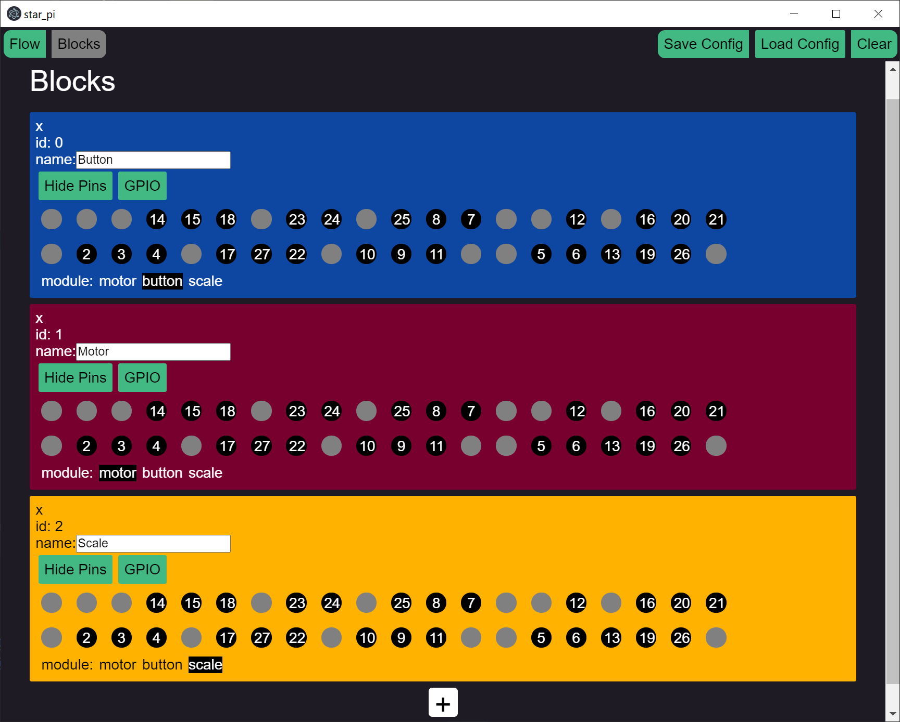
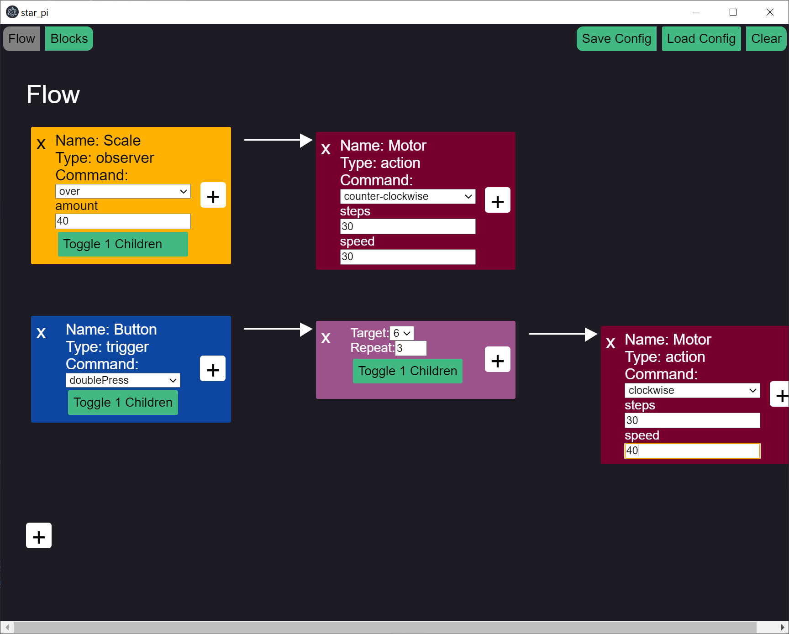

<!-- PROJECT LOGO -->
<br />
<p align="center">
  <a href="https://camo.githubusercontent.com/dfdc101ca03cc32dbc8e68771c03f8c7a8924ab5fa2457e60ffe78505d48acd7/68747470733a2f2f75706c6f61642e77696b696d656469612e6f72672f77696b6970656469612f636f6d6d6f6e732f7468756d622f322f32652f50692d73796d626f6c2e7376672f37393470782d50692d73796d626f6c2e7376672e706e67">
    
  </a>

<h3 align="center">Star_PI</h3>

  <p align="center">
    Graphical Taskbuilder for Raspberry Pi
    <br />
  </p>
</p>


**This project, as well as this readme is under heavy development.<br>Things are open to change drastically!**


<!-- TABLE OF CONTENTS -->
<details open="open">
  <summary>Table of Contents</summary>
  <ol>
    <li>
      <a href="#about-the-project">About The Project</a>
  </ol>
</details>

<!-- ABOUT THE PROJECT -->
## About The Project

<p align="center">


</p>

Star_Pi is a libary with the goal to allow non-technical people to access the possibilites of the raspberry pi.
Starpi consist of two independent parts:
- graphical logic editor
    * [star_pi_editor](https://github.com/datomo/star_pi_editor) (electron + vueJS)


- logical interpreter on raspberry pi
    * [star_pi_runner](https://github.com/datomo/star_pi_runner) (rust)

    
    

## Documentation
### Config File
The config file is used to pass the configured setup to the runner on the raspberry pi.
It uses a simple JSON structure and looks like this.

```
{
    "root": [
    // holds the different starting tasks
    ],
    "blocks": {
    // defines blocks which can be reused to define task chains
    },
    "flowBlocks": {
    // a flow block maps to a definied block and represents one step in the task chain
    },
    "loops": {
    // here all special loop blocks are listed, 
    // those are task blocks but without a normal block behind  them
    },
    "children": {
    // stores the relation of the flow blocks as parent -> children relations
    },
    "default": {
        // the default values for a new normal block
        "id": null,
        "pins": [],
        "name": "",
        "options": {}
    },
    "options": {
        // holds differnt addtional options
    },
    "relations": {
        // desribes which module belongs to which type group
    },
    "colors": {
        // gui options
        "action": "red",
        "trigger": "blue"
    },
    "id": 1,
    "flowId": 1,
    "fileName": "config.json"
}

```

<!-- LICENSE -->
## License

Distributed under the MIT License. See `LICENSE` for more information.


<!-- CONTACT -->
## Contact

David Lengweiler - [Homepage](https://lengweiler.com) - david@lengweiler.com


